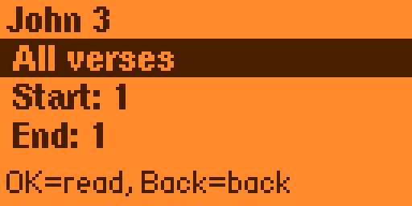

# Bible BSB

Flipper Zero apps for reading and saving Berean Standard Bible passages offline.

[](https://ko-fi.com/dpshade)

- `bible_bsb/` is the C app that ships. Build it with ufbt from that directory. The app id is `bible_bsb`.
- `src/` is the Rust prototype. Build it with `cargo build --release`. `scripts/validate.sh` checks that build. The package name is `kindled_spark`.

## Screens

<p align="center">
  
  
</p>
<p align="center">
  
  
</p>

## Features

- **Offline BSB reading** — Browse all 66 books by chapter and verse range. The chapter text is bundled with the app.
- **Passage / verse-range support** — Read a full chapter or select a start/end verse range.
- **Save to collection** — Save passages on the SD card.
- **Share via NFC** — Generate a `route.bible` URL and write it to a Flipper `.nfc` file for easy NFC tag sharing.
- **Paginated reader** — Word-wrapped text with Up/Down line scrolling and Left/Right page navigation.

## Installation

From `bible_bsb/`, build with [ufbt](https://github.com/flipperdevices/flipperzero-ufbt) and install `dist/bible_bsb.fap`. The chapter text is bundled via `fap_file_assets` and is installed to `/ext/apps_assets/bible_bsb/`. The app id is `bible_bsb`.

Saved passages are stored at `/ext/apps_data/bible_bsb/collection.json`.

To rebuild the bundled pack from the public-domain dataset:

```bash
python3 scripts/fetch_bsb.py --output bsb_sd/ --pack bible_bsb/assets/bsb.pack
```

The Rust prototype in `src/` can still be built with `cargo build --release`. `scripts/validate.sh` checks that build without launching it. It still reads `/ext/apps_data/kindled_spark/`.

## Navigation

| Screen | Controls |
|--------|----------|
| **Book List** | Up/Down = scroll, OK = select book, Back = quit |
| **Chapter List** | D-pad = move, OK = select chapter, Back = back |
| **Verse Select** | Left/Right = switch mode (All / Range), Up/Down = adjust verse, OK = read |
| **Reader** | Up/Down = scroll line, Left/Right = page, OK short = menu, OK long = quick save, Back = back |
| **Action Menu** | Up/Down = select, OK = confirm (Save / Share NFC / Back) |

## route.bible Integration

Every saved passage generates a canonical `route.bible` URL using the BSB translation:
```
https://route.bible/jhn.3.16?v=BSB&src=flipper_bible_bsb
```

## Data Format

The bundled chapter pack is `bible_bsb/assets/bsb.pack`. Saved passages are stored at `/ext/apps_data/bible_bsb/collection.json`.

## License

MIT. BSB text is public domain.
